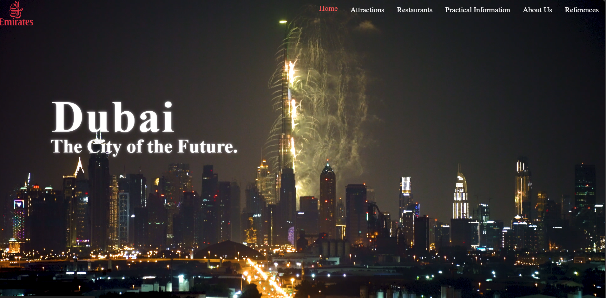

# Dubai Tourism Guide

Welcome to the **Dubai Tourism Guide** project! This website provides an all-encompassing guide for tourists planning to visit Dubai, highlighting its attractions, practical information, restaurants, and much more.



---

## Features

- **Home Page**: A stunning introductory page showcasing Dubai as the "City of the Future."
- **Attractions**:
  - Detailed descriptions of iconic landmarks such as the Burj Khalifa, Dubai Mall, Palm Jumeirah, and Burj Al Arab.
  - High-quality images to visualize these attractions.
- **Restaurants**:
  - Recommendations for must-visit restaurants, including Al-Baik, CZN Burak, Ristorante L'Olivo, and Nobu Dubai.
- **Practical Information**:
  - Important travel tips, including visa and passport requirements, weather advice, cultural mindfulness, and transportation options.
  - Essential Arabic phrases for better communication with locals.
- **About Us**:
  - Information about the project's mission and collaboration with Dubai's tourism department.
- **References**:
  - Cited resources and links for additional information on Dubai's attractions and amenities.

---

## File Structure

- `home.html`: The homepage introducing Dubai as the City of the Future.
- `one.html`: Page detailing Dubai's top attractions.
- `two.html`: Guide to the best restaurants in Dubai.
- `three.html`: Practical travel information, including visa requirements and cultural awareness.
- `four.html`: About Us page, describing the project's mission and partnership with Dubai Tourism.
- `five.html`: References and resources used in this project.
- `404.html`: Custom error page for any non-existent routes.
- `webstyle.css`: Central stylesheet for consistent and visually appealing design.
- Additional media files such as images and videos to enhance the user experience.

---

## How to Use

1. Clone the repository to your local machine:
   ```bash
   git clone <repository_url>
   ```
2. Open the project folder in your code editor.
3. Use a local server or open the HTML files directly in your browser to view the website.
   - Example local server command using Python:
     ```bash
     python -m http.server
     ```

---

## Technologies Used

- **HTML5**: For creating structured content.
- **CSS3**: For styling and layout.
- **JavaScript**: (Future feature) For interactivity and enhanced user experience.

---

## Contribution

Contributions are welcome! Feel free to submit a pull request or open an issue for suggestions, bug reports, or feature requests.

---

## License

This project is licensed under the [MIT License](LICENSE).

---
